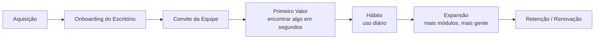
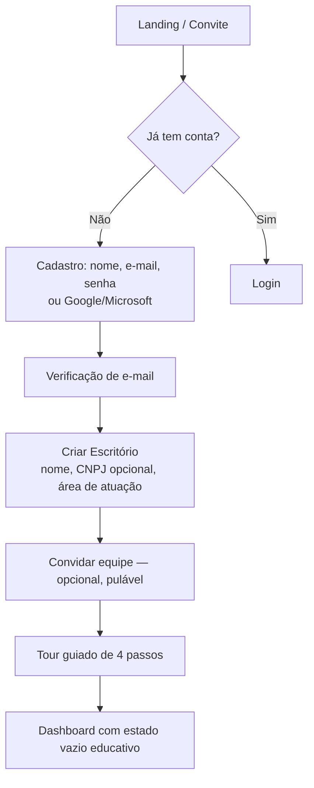
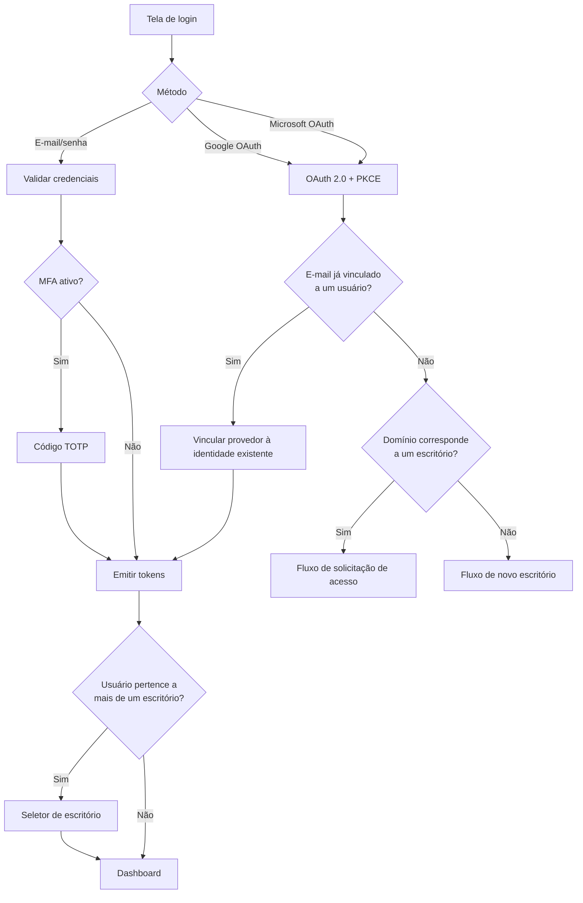
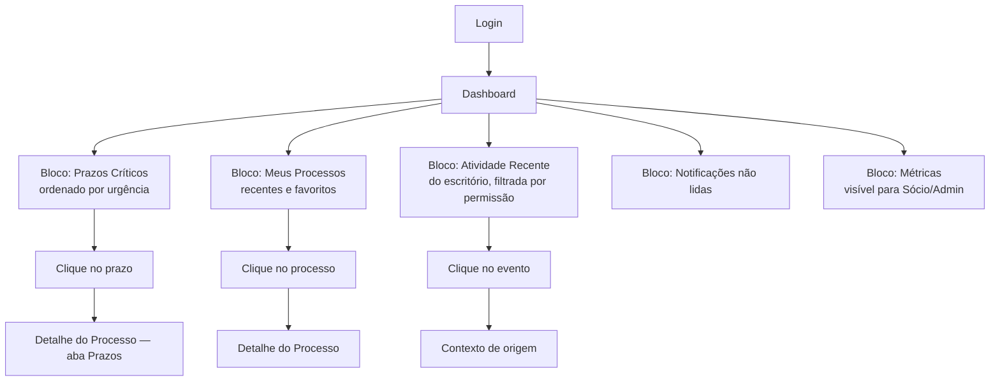
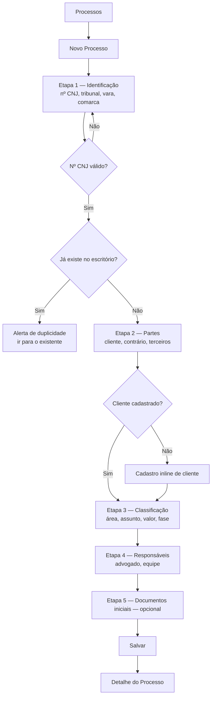
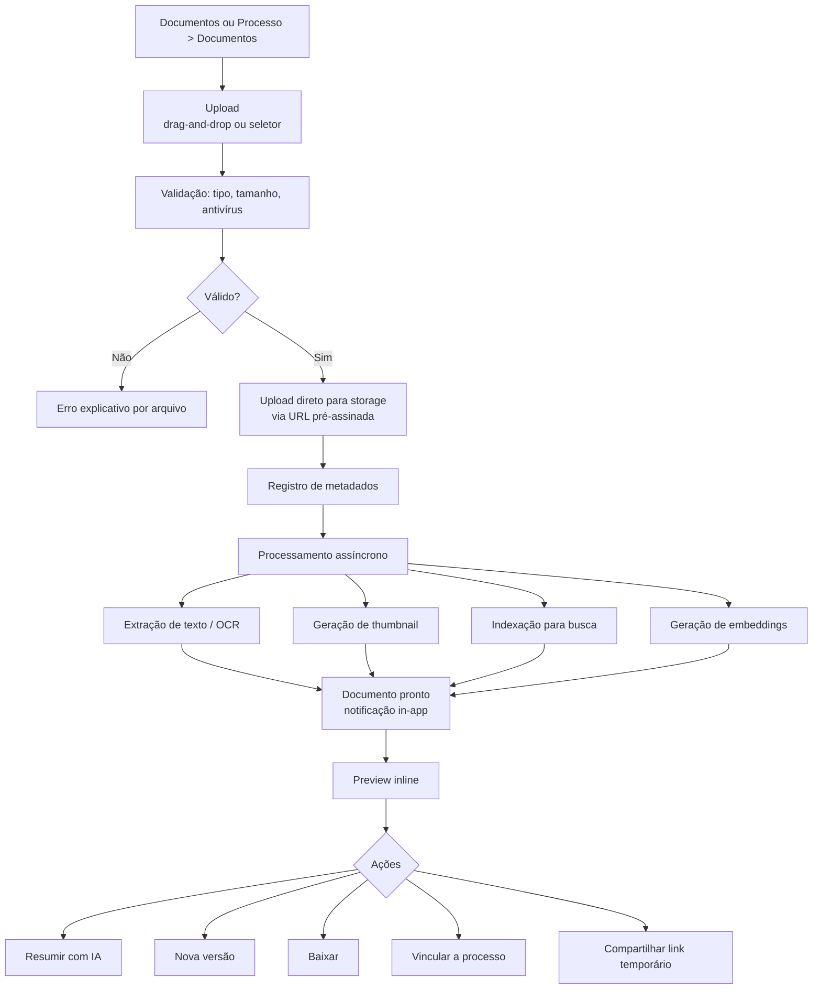
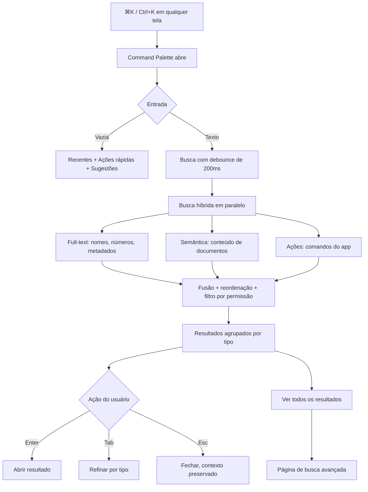
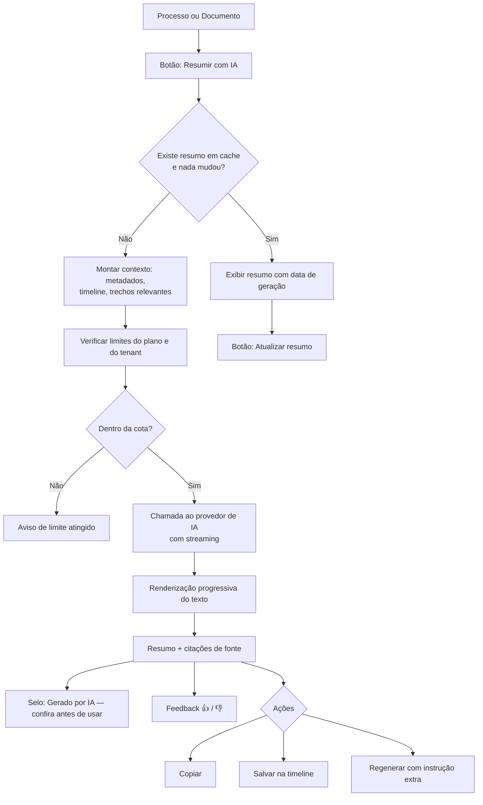
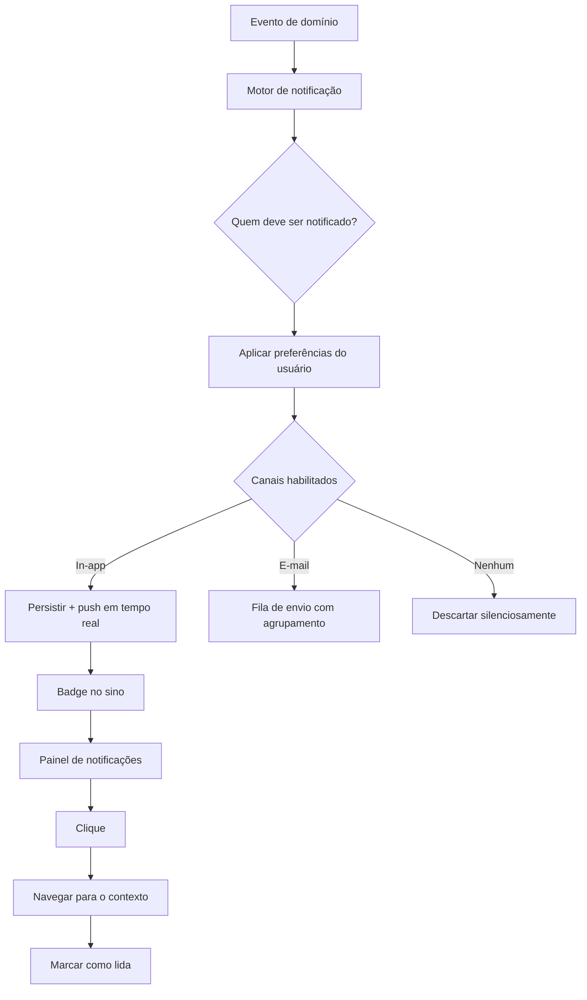

# 03 — Fluxos de Usuário e Árvore de Telas

---

## 3.1 Mapa de jornada macro



**Momento de ativação (aha moment):** quando o usuário abre a busca global,
digita três palavras e encontra o documento certo — vindo de *dentro* de um PDF —
em menos de 10 segundos. Todo o onboarding é desenhado para levar até esse
instante o mais rápido possível.

---

## 3.2 Fluxo 1 — Autenticação e primeiro acesso

### 3.2.1 Cadastro do escritório (novo tenant)



**Regras**
- O criador do escritório recebe o papel `SOCIO` automaticamente.
- Verificação de e-mail obrigatória antes de qualquer escrita de dado.
- "Convidar equipe" é pulável — bloquear aqui mata a ativação.
- Estado vazio do Dashboard não é uma tela em branco: traz três cartões de ação
  ("Cadastrar primeiro processo", "Subir documentos", "Convidar equipe").

### 3.2.2 Login



**Regras**
- Rate limiting progressivo: 5 tentativas → captcha → bloqueio temporário de 15 min.
- Mensagem de erro genérica ("Credenciais inválidas") — nunca revelar se o e-mail existe.
- "Lembrar de mim" estende apenas o refresh token, nunca o access token.
- Vinculação de conta OAuth a usuário existente exige que o e-mail esteja verificado
  no provedor — caso contrário é vetor de account takeover.

### 3.2.3 Recuperação de senha
Solicitação → e-mail com token de uso único (TTL 30 min) → nova senha → **revogação
de todas as sessões ativas** → notificação de segurança por e-mail.

---

## 3.3 Fluxo 2 — Dashboard (rotina diária)



**Regras**
- O Dashboard é **personalizado por papel**: Sócio vê métricas de carteira;
  Advogado vê a própria carga; Estagiário vê só o que lhe foi atribuído.
- Prazos críticos usam semáforo: vermelho ≤2 dias, âmbar ≤7 dias, neutro >7 dias.
- Carregamento por blocos independentes (streaming/Suspense) — um bloco lento
  não pode segurar a tela inteira.
- Nenhum bloco pode exigir agregação síncrona pesada; ver [05](05-arquitetura-backend.md) §5.9.

---

## 3.4 Fluxo 3 — Processos

### 3.4.1 Cadastro



**Regras**
- Rascunho salvo automaticamente a cada etapa — fechar a aba não perde trabalho.
- Só a Etapa 1 é obrigatória; o processo pode nascer incompleto e ser completado depois.
- Cadastro inline de cliente evita troca de contexto (dor da Sandra).
- Detecção de duplicidade por número CNJ é obrigatória.

### 3.4.2 Detalhe do processo — estrutura em abas

| Aba | Conteúdo |
|---|---|
| **Visão Geral** | Resumo por IA, dados principais, partes, responsáveis, próximo prazo |
| **Timeline** | Andamentos, documentos, comentários e eventos de IA, unificados e filtráveis |
| **Documentos** | Documentos do processo, agrupáveis por tipo, com versões |
| **Prazos** | Prazos e tarefas, com status e responsável |
| **Partes** | Cliente, contrário, terceiros, advogados adversos |
| **Comentários** | Discussão interna, com @menção |
| **Histórico** | Trilha de auditoria do processo (quem alterou o quê) |

### 3.4.3 Lista de processos
Filtros: status, responsável, cliente, área, tribunal, faixa de prazo, tags.
Ordenação: atualização, prazo, valor, criação. Visões salvas (ex.: "Meus urgentes").
Todo o estado de filtro vive na **query string** — links compartilháveis.

---

## 3.5 Fluxo 4 — Documentos



**Regras**
- Upload **direto ao storage** com URL pré-assinada — o arquivo não trafega pela API.
- Estado do documento: `ENVIANDO → PROCESSANDO → PRONTO | FALHA`. A UI mostra o
  estado; documento em `PROCESSANDO` já é visível e baixável, apenas não é buscável ainda.
- Versionamento: nova versão nunca sobrescreve; a anterior fica acessível e a
  versão vigente é sempre explícita (mata o "v3_final_agora_vai").
- Exclusão é **soft delete** com lixeira de 30 dias.
- Toda visualização e download gera evento de auditoria (sigilo profissional).

---

## 3.6 Fluxo 5 — Busca Global (funcionalidade âncora)



**Regras**
- Aberta de qualquer lugar, sem perder o contexto da tela atual.
- Navegação 100% por teclado (↑ ↓ Enter Tab Esc).
- Filtragem por permissão acontece **no backend, antes do retorno** — nunca no
  cliente. Vazar a existência de um processo já é vazamento de sigilo.
- Grupos: Processos · Documentos · Clientes · Pessoas · Ações.
- Resposta abaixo de 400 ms (p95) ou a proposta de valor cai.
- Prefixos de escopo: `p:` processos, `d:` documentos, `c:` clientes, `>` ações.

---

## 3.7 Fluxo 6 — Resumo por IA



**Regras — a IA é a área de maior risco reputacional do produto**
- **Nunca** apresentar saída de IA sem selo de geração automática.
- **Sempre** citar a fonte (documento + página/trecho) — o advogado precisa conferir.
- Streaming obrigatório: percepção de velocidade importa mais que latência total.
- Cache com invalidação por alteração do processo (novo documento, novo andamento).
- Cota por tenant e por usuário, com telemetria de custo por chamada.
- O resumo é **sugestão**, jamais parecer jurídico. Copy do produto reforça isso.
- Dados enviados ao provedor: contrato de não-treinamento obrigatório; ver
  [09-seguranca-lgpd.md](09-seguranca-lgpd.md) §9.8.

---

## 3.8 Fluxo 7 — Notificações



**Tipos de evento:** prazo se aproximando (D-7, D-3, D-1) · novo andamento ·
documento adicionado ao meu processo · @menção em comentário · processo atribuído
a mim · resumo de IA concluído · alerta de segurança (novo login, senha alterada).

**Regras**
- Preferências granulares por tipo × canal.
- Agrupamento por digest para evitar fadiga (e-mail resumo diário como padrão em
  eventos de baixa criticidade).
- Alertas de segurança **não** são desativáveis.
- Notificação nunca contém dado sigiloso no corpo do e-mail — só o contexto
  mínimo e um link autenticado.

---

## 3.9 Fluxo 8 — Perfil e Conta

Perfil → dados pessoais (nome, foto, cargo, OAB, telefone) · preferências
(tema, idioma, densidade, notificações) · segurança (senha, MFA, sessões ativas
com revogação individual, contas vinculadas) · privacidade (exportar meus dados,
solicitar exclusão — LGPD arts. 18 e 19).

---

## 3.10 Árvore de telas

```
/
├── (público)
│   ├── /login
│   ├── /cadastro
│   ├── /esqueci-senha
│   ├── /redefinir-senha/[token]
│   ├── /verificar-email/[token]
│   ├── /convite/[token]
│   └── /auth/callback/[provedor]
│
├── (onboarding)
│   ├── /onboarding/escritorio
│   ├── /onboarding/equipe
│   └── /onboarding/tour
│
├── (app) — autenticado, dentro do AppShell
│   ├── /                                  Dashboard
│   ├── /processos
│   │   ├── /processos                     Lista + filtros
│   │   ├── /processos/novo                Wizard de cadastro
│   │   └── /processos/[id]
│   │       ├── /                          Visão Geral
│   │       ├── /timeline
│   │       ├── /documentos
│   │       ├── /prazos
│   │       ├── /partes
│   │       ├── /comentarios
│   │       ├── /historico
│   │       └── /editar
│   │
│   ├── /documentos
│   │   ├── /documentos                    Biblioteca + filtros
│   │   ├── /documentos/upload
│   │   └── /documentos/[id]
│   │       ├── /                          Preview + metadados
│   │       └── /versoes
│   │
│   ├── /clientes
│   │   ├── /clientes
│   │   ├── /clientes/novo
│   │   └── /clientes/[id]
│   │
│   ├── /busca                             Busca avançada (resultado completo)
│   │
│   ├── /notificacoes
│   │
│   ├── /perfil
│   │   ├── /perfil                        Dados pessoais
│   │   ├── /perfil/preferencias
│   │   ├── /perfil/seguranca
│   │   └── /perfil/privacidade
│   │
│   └── /admin                             Somente ADMIN / SOCIO
│       ├── /admin/escritorio              Dados do escritório
│       ├── /admin/usuarios                Lista, convites, desativação
│       ├── /admin/perfis                  Papéis e permissões
│       ├── /admin/auditoria                Log de auditoria + exportação
│       ├── /admin/integracoes             SSO, provedores
│       └── /admin/faturamento             Plano e cotas
│
└── (overlays globais)
    ├── Command Palette (⌘K)
    ├── Painel de Notificações
    ├── Menu de Usuário
    └── Seletor de Escritório (multi-tenant)
```

---

## 3.11 Estados de tela obrigatórios

Toda tela de lista ou detalhe deve especificar **cinco** estados. Isso é
contrato de implementação, não recomendação:

| Estado | Requisito |
|---|---|
| **Carregando** | Skeleton com a forma do conteúdo real — nunca spinner de tela cheia |
| **Vazio (primeiro uso)** | Ilustração + explicação + ação primária ("Cadastre seu primeiro processo") |
| **Vazio (sem resultado)** | Diferente do anterior: sugere limpar filtro ou refinar busca |
| **Erro** | Mensagem humana + botão "Tentar novamente" + código de correlação para suporte |
| **Sem permissão** | Explica que o item existe mas o acesso é restrito **ou**, em contexto sigiloso, retorna 404 para não revelar a existência |

---

## 3.12 Atalhos de teclado

| Atalho | Ação |
|---|---|
| `⌘K` / `Ctrl+K` | Busca global |
| `G` depois `D` | Ir para Dashboard |
| `G` depois `P` | Ir para Processos |
| `G` depois `A` | Ir para Documentos (Arquivos) |
| `N` | Novo (contextual à tela) |
| `/` | Focar no campo de busca da página |
| `?` | Lista de atalhos |
| `Esc` | Fechar overlay |

---

**Anterior:** [02-personas.md](02-personas.md) · **Próximo:** [04-arquitetura-frontend.md](04-arquitetura-frontend.md)
