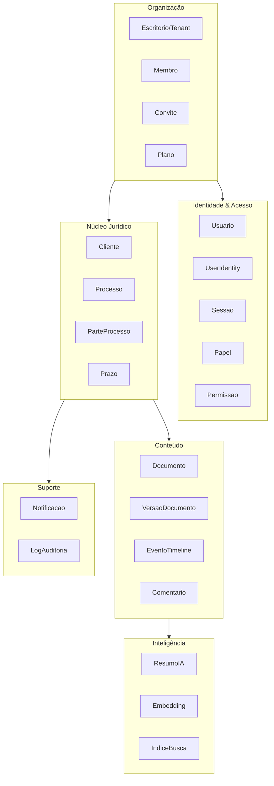
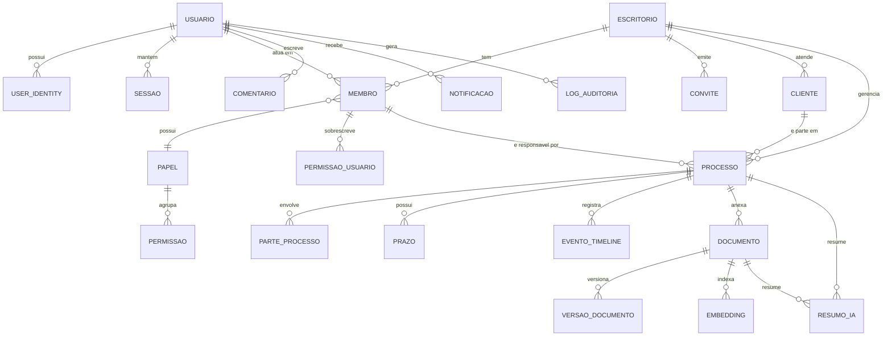

# 06 — Modelo de Domínio

> Modelagem conceitual de entidades, atributos, relacionamentos e invariantes.
> **Sem SQL e sem DDL**, conforme escopo definido.

---

## 6.1 Mapa de contextos delimitados (Bounded Contexts)

**Agregados e suas raízes:**

| Agregado | Raiz | Contém | Invariante principal |
|---|---|---|---|
| Escritório | `Escritorio` | Membros, Convites, Plano | Sempre ≥1 membro com papel OWNER |
| Usuário | `Usuario` | Identidades, Preferências, Sessões | E-mail único globalmente |
| Processo | `Processo` | Partes, Prazos, Responsáveis | Número CNJ único por escritório |
| Documento | `Documento` | Versões | Exatamente uma versão vigente |
| Cliente | `Cliente` | Contatos, Endereços | Documento (CPF/CNPJ) único por escritório |

Referência entre agregados é **por identificador**, nunca por objeto — regra que
mantém as fronteiras transacionais claras e viabiliza extração futura de módulos.

---

## 6.2 Contexto: Identidade e Acesso

### Usuario
Pessoa física com credencial de acesso. É **global**, não pertence a um tenant —
um advogado pode atuar em mais de um escritório.

| Atributo | Tipo | Notas |
|---|---|---|
| `id` | UUID | |
| `email` | Email (VO) | Único global, normalizado em minúsculas |
| `emailVerificadoEm` | Timestamp? | Nulo = não verificado |
| `senhaHash` | String? | Nulo se autentica só por OAuth |
| `nome` / `sobrenome` | String | |
| `avatarUrl` | URL? | |
| `telefone` | Telefone (VO)? | |
| `oab` | OAB (VO)? | Número + seccional; obrigatório para papel ADVOGADO |
| `cargo` | String? | Texto livre |
| `tipo` | Enum | `INTERNO` \| `EXTERNO` — prepara o Portal do Cliente |
| `mfaHabilitado` | Boolean | |
| `mfaSegredo` | String? | Criptografado em repouso |
| `idioma` / `fusoHorario` | String | Padrão `pt-BR` / `America/Sao_Paulo` |
| `tema` | Enum | `CLARO` \| `ESCURO` \| `SISTEMA` |
| `ultimoAcessoEm` | Timestamp? | |
| `status` | Enum | `ATIVO` \| `INATIVO` \| `BLOQUEADO` \| `PENDENTE` |
| `anonimizadoEm` | Timestamp? | LGPD art. 18 — anonimização, não exclusão física |

*Invariantes:* precisa de senha **ou** ≥1 identidade OAuth · e-mail verificado
antes de qualquer escrita de dado · usuário `INATIVO` não autentica.

### UserIdentity
Vínculo com provedor externo. Um usuário → N identidades.
`provedor` (`LOCAL`|`GOOGLE`|`MICROSOFT`|`SAML`) · `provedorUserId` · `emailProvedor` ·
`emailVerificadoNoProvedor` · `metadados`. Único por (`provedor`, `provedorUserId`).

### Sessao
`usuarioId` · `escritorioId` · `refreshTokenHash` · `familiaId` (para detecção de
reuso) · `ip` · `userAgent` · `dispositivo` · `criadaEm` · `expiraEm` ·
`revogadaEm?` · `motivoRevogacao?`.

### Papel (Role)
Papéis do sistema (imutáveis: OWNER, ADMIN, SOCIO, ADVOGADO, ESTAGIARIO,
ASSISTENTE, CLIENTE) e papéis customizados por escritório.
`escritorioId?` (nulo = papel de sistema) · `nome` · `descricao` · `nivel`
(hierarquia numérica) · `permissoes[]` · `ehSistema`.

### Permissao
`chave` (`recurso:acao:escopo`) · `recurso` · `acao` · `escopo`
(`ALL`|`TEAM`|`ASSIGNED`|`OWN`) · `descricao` · `categoria`.

### PermissaoUsuario (override)
`membroId` · `permissaoChave` · `efeito` (`CONCEDER`|`NEGAR`) · `concedidaPor` ·
`expiraEm?`. **`NEGAR` sempre vence** sobre qualquer concessão por papel.

---

## 6.3 Contexto: Organização

### Escritorio (Tenant)
| Atributo | Notas |
|---|---|
| `id` · `slug` | Slug único, usado em URL e subdomínio futuro |
| `nomeFantasia` · `razaoSocial` | |
| `cnpj` | CNPJ (VO), opcional |
| `logoUrl` · `corPrimaria` | Personalização visual leve |
| `areasAtuacao[]` | Cível, Trabalhista, Tributário… |
| `endereco` · `telefone` · `emailContato` | |
| `plano` | `TRIAL` \| `ESSENCIAL` \| `PROFISSIONAL` \| `ENTERPRISE` |
| `limites` | JSON: usuários, armazenamento, cota de IA/mês |
| `status` | `ATIVO` \| `SUSPENSO` \| `CANCELADO` |
| `configuracoes` | JSON: MFA obrigatório, retenção, domínios de SSO |

*Invariante:* sempre ≥1 membro ativo com papel `OWNER`.

### Membro (Membership)
Vínculo Usuario ↔ Escritorio — **o "usuário do tenant"**.
`usuarioId` · `escritorioId` · `papelId` · `equipeId?` · `status`
(`ATIVO`|`INATIVO`|`SUSPENSO`) · `entrouEm` · `desativadoEm?` · `desativadoPor?`.
Único por (`usuarioId`, `escritorioId`).

> **Decisão-chave:** toda autorização é resolvida sobre `Membro`, não sobre
> `Usuario`. O mesmo advogado pode ser SOCIO em um escritório e ADVOGADO em outro.

### Convite
`escritorioId` · `email` · `papelId` · `tokenHash` · `convidadoPor` ·
`expiraEm` (7 dias) · `aceitoEm?` · `status`.

### Equipe *(opcional, habilita escopo TEAM)*
`escritorioId` · `nome` · `liderId` · `membros[]`.

---

## 6.4 Contexto: Núcleo Jurídico

### Cliente
| Atributo | Notas |
|---|---|
| `escritorioId` | Tenant |
| `tipo` | `PESSOA_FISICA` \| `PESSOA_JURIDICA` |
| `nome` / `razaoSocial` · `nomeFantasia?` | |
| `documento` | CPF ou CNPJ (VO validado) — único por escritório |
| `emails[]` · `telefones[]` · `enderecos[]` | Múltiplos, com rótulo |
| `contatos[]` | Pessoas de contato (para PJ) |
| `responsavelId` | Membro responsável pela conta |
| `origem` · `tags[]` · `observacoes` | |
| `usuarioPortalId?` | *(Fase 3)* vínculo com acesso externo |
| `status` | `ATIVO` \| `INATIVO` \| `PROSPECT` |

### Processo ⭐ *(agregado central)*

| Atributo | Tipo | Notas |
|---|---|---|
| `escritorioId` | UUID | |
| `numeroCnj` | NumeroCNJ (VO) | Formato `NNNNNNN-DD.AAAA.J.TR.OOOO`, dígito validado. Único por escritório |
| `numeroInterno` | String? | Numeração própria do escritório |
| `titulo` | String | Rótulo legível ("Ação Trabalhista — Cliente X") |
| `descricao` | Texto? | |
| `tipo` | Enum | `JUDICIAL` \| `ADMINISTRATIVO` \| `CONSULTIVO` \| `EXTRAJUDICIAL` |
| `area` | Enum | Cível, Trabalhista, Tributário, Penal, Família, Empresarial… |
| `assunto` | String? | Assunto CNJ |
| `classe` | String? | Classe processual CNJ |
| `fase` | Enum | `CONHECIMENTO` \| `RECURSAL` \| `EXECUCAO` \| `ARQUIVADO` |
| `status` | StatusProcesso (VO) | `ATIVO` \| `SUSPENSO` \| `ARQUIVADO` \| `ENCERRADO` |
| `tribunal` · `vara` · `comarca` · `uf` | String? | |
| `instancia` | Enum | `PRIMEIRA` \| `SEGUNDA` \| `SUPERIOR` |
| `valorCausa` | Monetario (VO)? | Valor + moeda |
| `segredoJustica` | Boolean | **Restringe visibilidade mesmo internamente** |
| `clienteId` | UUID | |
| `polo` | Enum | `ATIVO` \| `PASSIVO` \| `TERCEIRO` — posição do nosso cliente |
| `responsavelId` | UUID | Membro principal |
| `equipeIds[]` | UUID[] | Membros com acesso |
| `dataDistribuicao` · `dataEncerramento?` | Date | |
| `tags[]` | String[] | |
| `camposCustomizados` | JSON | Extensibilidade sem migração |
| `resumoIaId?` | UUID | Resumo vigente em cache |
| `ultimaAtualizacaoEm` | Timestamp | Alimenta ordenação e detecção de processo parado |
| `arquivadoEm?` · `excluidoEm?` | Timestamp | Soft delete |

*Invariantes:*
- Número CNJ, se presente, é válido e único no escritório.
- Sempre há um `responsavelId` ativo.
- Processo `ARQUIVADO` não aceita novo prazo.
- `segredoJustica = true` → acesso restrito a responsável, equipe e SOCIO/OWNER,
  **independentemente** de o papel ter `case:read:all`.
- Transições de status são explícitas; não há mudança arbitrária.

*Eventos de domínio:* `ProcessoCriado` · `ProcessoAtribuido` ·
`ProcessoStatusAlterado` · `ProcessoArquivado` · `PrazoAdicionado` ·
`DocumentoVinculado`.

### ParteProcesso
`processoId` · `tipo` (`AUTOR`|`REU`|`TERCEIRO`|`ASSISTENTE`|`MP`) ·
`natureza` (`PF`|`PJ`) · `nome` · `documento?` · `clienteId?` (se for cliente
nosso) · `advogados[]` (nome + OAB) · `ehNossoCliente`.

### Prazo
| Atributo | Notas |
|---|---|
| `processoId` · `escritorioId` | |
| `titulo` · `descricao?` | |
| `tipo` | `FATAL` \| `INTERNO` \| `AUDIENCIA` \| `REUNIAO` \| `TAREFA` |
| `dataVencimento` · `horaVencimento?` | |
| `dataConclusao?` | |
| `responsavelId` | |
| `prioridade` | `BAIXA` \| `MEDIA` \| `ALTA` \| `CRITICA` |
| `status` | `PENDENTE` \| `EM_ANDAMENTO` \| `CONCLUIDO` \| `CANCELADO` \| `ATRASADO` |
| `lembretes[]` | Offsets: D-7, D-3, D-1, D-0 |
| `origem` | `MANUAL` \| `IMPORTADO` \| `IA` \| `TRIBUNAL` (futuro) |

*Invariantes:* prazo `FATAL` não pode ser excluído, apenas cancelado com
justificativa registrada em auditoria · status `ATRASADO` é derivado, não digitado.

---

## 6.5 Contexto: Conteúdo

### Documento
| Atributo | Notas |
|---|---|
| `escritorioId` · `processoId?` · `clienteId?` | Documento pode existir sem processo |
| `titulo` · `descricao?` | |
| `tipo` | `PETICAO` \| `CONTRATO` \| `PROCURACAO` \| `SENTENCA` \| `DECISAO` \| `COMPROVANTE` \| `PARECER` \| `OUTRO` |
| `categoria` · `tags[]` | |
| `versaoVigenteId` | Ponteiro para a versão atual |
| `visibilidade` | `INTERNA` \| `COMPARTILHADA` \| `PUBLICA` — **prepara o Portal do Cliente** |
| `confidencial` | Boolean — restringe além do padrão |
| `statusProcessamento` | `PENDENTE` \| `PROCESSANDO` \| `PRONTO` \| `FALHA` |
| `criadoPor` · `criadoEm` · `atualizadoEm` | |
| `excluidoEm?` · `excluidoPor?` | Soft delete, lixeira de 30 dias |

*Invariantes:* exatamente uma versão vigente · exclusão do processo **não** exclui
documentos (ficam órfãos e recuperáveis) · documento em `PROCESSANDO` é visível e
baixável, mas não aparece na busca por conteúdo.

### VersaoDocumento
`documentoId` · `numero` (incremental) · `nomeArquivo` · `mimeType` · `tamanhoBytes` ·
`chaveStorage` · `hashSha256` (deduplicação e integridade) · `textoExtraido?` ·
`paginas?` · `ocrAplicado` · `statusAntivirus` · `enviadoPor` · `enviadoEm` ·
`notasDaVersao?`.

*Invariante:* versão é **imutável** após criada. Correção = nova versão.

### EventoTimeline ⭐
Unifica a história do processo. Polimórfico por `tipo`:

`processoId` · `escritorioId` · `tipo` (`ANDAMENTO`|`DOCUMENTO`|`COMENTARIO`|
`PRAZO`|`STATUS`|`ATRIBUICAO`|`IA`|`SISTEMA`) · `titulo` · `descricao?` ·
`dataEvento` (data do fato, ≠ data do registro) · `dataRegistro` ·
`autorId?` (nulo se gerado pelo sistema) · `origem` (`MANUAL`|`SISTEMA`|`IA`|`IMPORTACAO`) ·
`entidadeRelacionadaTipo/Id` · `visibilidade` (`INTERNA`|`COMPARTILHADA`) ·
`metadados` (JSON por tipo) · `fixado` (destacar no topo).

> **Decisão:** timeline única em vez de tabelas separadas por tipo de evento.
> Consulta cronológica é o acesso dominante; unificar simplifica leitura,
> paginação e a montagem de contexto para a IA. O custo é uma coluna de metadados
> polimórfica — trade-off aceito conscientemente.

### Comentario
`escritorioId` · `entidadeTipo` (`PROCESSO`|`DOCUMENTO`|`CLIENTE`|`PRAZO`) ·
`entidadeId` · `autorId` · `conteudo` (rich text sanitizado) · `mencoes[]` ·
`comentarioPaiId?` (thread de 1 nível) · `visibilidade`
(`INTERNA`|`COMPARTILHADA`) · `editadoEm?` · `excluidoEm?` · `anexos[]`.

*Invariante crítico:* comentário `INTERNA` **nunca** é exposto a usuário
`EXTERNO`. Isso é regra de segurança, aplicada na camada de dados — não é filtro
de UI.

---

## 6.6 Contexto: Inteligência

### ResumoIA
`escritorioId` · `entidadeTipo` (`PROCESSO`|`DOCUMENTO`) · `entidadeId` ·
`tipoResumo` (`GERAL`|`EXECUTIVO`|`CRONOLOGICO`|`PONTOS_CHAVE`|`RISCOS`) ·
`conteudo` (markdown) · `fontes[]` (documento + trecho + página) ·
`modelo` · `promptVersao` · `tokensEntrada`/`tokensSaida` · `custoEstimado` ·
`latenciaMs` · `hashContexto` (invalidação de cache) · `geradoPor` · `geradoEm` ·
`feedback` (`POSITIVO`|`NEGATIVO`|null) · `comentarioFeedback?` · `vigente`.

*Invariantes:* todo resumo carrega `fontes` · resumo é invalidado quando
`hashContexto` diverge · resumo nunca sobrescreve conteúdo humano.

### Embedding
`escritorioId` · `entidadeTipo` · `entidadeId` · `trecho` · `indiceTrecho` ·
`vetor` · `modeloEmbedding` · `metadados` (página, seção). Índice HNSW.

### IndiceBusca
Projeção desnormalizada e otimizada para leitura: `entidadeTipo` · `entidadeId` ·
`titulo` · `conteudoIndexado` · `vetorTsv` · `filtros` (JSON) ·
`permissaoEscopo` (responsável, equipe, confidencialidade) · `atualizadoEm`.

---

## 6.7 Contexto: Suporte

### Notificacao
`escritorioId` · `destinatarioId` · `tipo` · `titulo` · `mensagem` ·
`entidadeTipo/Id` · `urlAcao` · `prioridade` · `lidaEm?` · `arquivadaEm?` ·
`canaisEnviados[]` · `agrupamentoChave` (para digest).

### PreferenciaNotificacao
`membroId` · `tipoNotificacao` · `inApp` · `email` · `frequencia`
(`IMEDIATA`|`DIARIA`|`SEMANAL`|`NUNCA`).
*Regra:* notificações de segurança ignoram preferência.

### LogAuditoria
`escritorioId` · `atorId?` · `atorTipo` (`USUARIO`|`SISTEMA`|`API`) · `acao` ·
`recursoTipo` · `recursoId` · `dadosAntes?` · `dadosDepois?` (com redação) ·
`ip` · `userAgent` · `correlationId` · `resultado` (`SUCESSO`|`FALHA`|`NEGADO`) ·
`criadoEm`. **Append-only.**

---

## 6.8 Value Objects

| VO | Regra |
|---|---|
| `Email` | RFC + normalização em minúsculas |
| `NumeroCNJ` | 20 dígitos, dígito verificador módulo 97 |
| `CPF` / `CNPJ` | Dígitos verificadores |
| `OAB` | Número + seccional (UF) |
| `Telefone` | E.164, com suporte a formato brasileiro |
| `Monetario` | Inteiro em centavos + moeda — **jamais float** |
| `Periodo` | Início ≤ fim |
| `StatusProcesso` | Máquina de estados com transições válidas explícitas |
| `Endereco` | Logradouro, número, complemento, bairro, cidade, UF, CEP |

---

## 6.9 Relacionamentos (visão consolidada)

---

## 6.10 Decisões de modelagem e seus porquês

| Decisão | Racional |
|---|---|
| `Usuario` global + `Membro` por tenant | Advogado atua em múltiplos escritórios; sem isso, contas duplicadas |
| Timeline unificada | Consulta cronológica é o acesso dominante; simplifica leitura e contexto de IA |
| `visibilidade` desde o MVP | Portal do Cliente sem migração de risco em dado sigiloso |
| Soft delete em tudo relevante | Exigência jurídica de rastreabilidade; erro humano é recuperável |
| Versão imutável de documento | Integridade probatória; "qual versão foi protocolada?" precisa de resposta |
| `camposCustomizados` JSON | Cada área do Direito quer campos próprios; evita explosão de colunas |
| Valores em centavos | Ponto flutuante em valor de causa é defeito, não detalhe |
| `segredoJustica` como flag de primeira classe | Obrigação legal, não preferência de exibição |
| `hashContexto` em resumo de IA | Sem isso, o cache serve resumo desatualizado — pior que não ter resumo |
| Referência entre agregados por ID | Mantém fronteiras transacionais e viabiliza extração de módulos |

---

**Anterior:** [05-arquitetura-backend.md](05-arquitetura-backend.md) · **Próximo:** [07-design-system.md](07-design-system.md)
