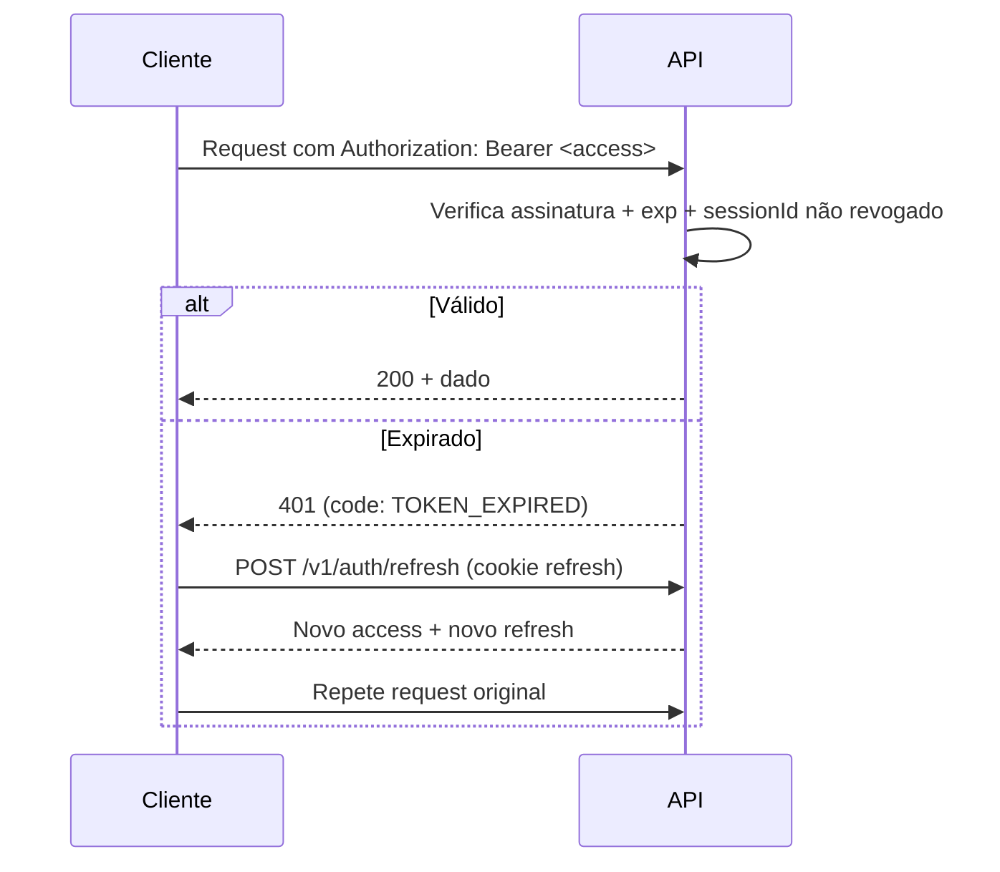
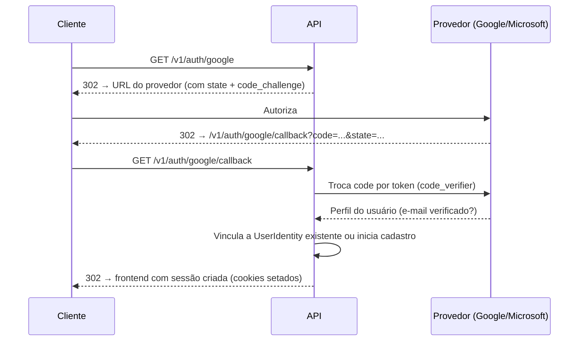

# 02 — Autenticação (Mecanismo)

> Reafirma [../05-arquitetura-backend.md §5.5](../05-arquitetura-backend.md) e
> entidades de [../database/03-entidades-identidade-escritorios.md](../database/03-entidades-identidade-escritorios.md).
> Este documento explica o mecanismo; os endpoints em si estão em
> [04-identity.md](04-identity.md).

## 2.1 Tokens

| Token | TTL | Transporte | Conteúdo (claims) |
|---|---|---|---|
| Access | 15 min | `Authorization: Bearer` (SPA) ou cookie `httpOnly` (SSR do Next.js) | `sub` (usuarioId), `tenantId` (escritorioId ativo), `membroId`, `roles`, `permissions`, `sessionId`, `jti`, `iat`, `exp` |
| Refresh | 7 dias (30 com "lembrar de mim") | Cookie `httpOnly`, `Secure`, `SameSite=Lax` | `sub`, `sessionId`, `familyId`, `jti`, `exp` |

O access token **nunca** é acessível a JavaScript quando emitido via cookie
(SSR); em fluxo de SPA pura, fica em memória (nunca em `localStorage` —
vetor de XSS). O refresh token é **sempre** cookie `httpOnly` — nunca exposto
ao JavaScript do cliente em nenhum fluxo.

## 2.2 Ciclo de vida do access token

## 2.3 Rotação de refresh token e detecção de reuso

Cada `POST /v1/auth/refresh` invalida o refresh token apresentado e emite um
novo par — reafirma
[../05-arquitetura-backend.md §5.5](../05-arquitetura-backend.md). Se um
refresh já usado for reapresentado, toda a `familyId` é revogada e a
`Sessao` correspondente marca `motivoRevogacao = REUSO_DETECTADO`
([../database/03-entidades-identidade-escritorios.md §3.3](../database/03-entidades-identidade-escritorios.md)) —
o cliente recebe `401 (code: SESSION_REVOKED)` e deve autenticar novamente;
uma notificação de segurança (`prioridade = SEGURANCA`) é emitida ao usuário.

## 2.4 Revogação em tempo real

`sessionId` do access token é verificado contra um denylist em Redis a cada
requisição (reafirma
[../05-arquitetura-backend.md §5.5](../05-arquitetura-backend.md)). Logout,
troca de senha, desativação de membro e detecção de reuso adicionam o
`sessionId` ao denylist imediatamente — a revogação tem efeito em segundos,
não em até 15 minutos (TTL do access token).

## 2.5 OAuth 2.0 — Google e Microsoft

Authorization Code + PKCE. Fluxo:

`state` assinado (JWT curto, TTL 5 min) e de uso único — mitiga CSRF no
fluxo OAuth. Vinculação automática a usuário existente só ocorre se o
e-mail vier verificado pelo provedor (reafirma
[../database/03-entidades-identidade-escritorios.md §3.2](../database/03-entidades-identidade-escritorios.md)).

## 2.6 MFA (TOTP)

Login com senha, se `mfaHabilitado = true`, retorna `202` com
`code: MFA_REQUIRED` e um `mfaChallengeToken` de uso único (TTL 5 min) em vez
do par de tokens final — o cliente então chama
`POST /v1/auth/mfa/verify` com o código de 6 dígitos + `mfaChallengeToken`
para completar o login.

## 2.7 Cookies vs. Bearer — quando usar cada um

| Contexto | Mecanismo |
|---|---|
| Next.js Server Component / Server Action | Cookie `httpOnly` (access + refresh) — o servidor Next.js repassa como Bearer para a API em nome do usuário |
| Client Component com `fetch`/TanStack Query | Access token em memória, injetado como `Authorization: Bearer` pelo interceptor do cliente HTTP ([../04-arquitetura-frontend.md §4.4](../04-arquitetura-frontend.md)) |
| Refresh | Sempre cookie `httpOnly` — nunca em corpo de resposta lido por JS |

## 2.8 Expiração e "lembrar de mim"

"Lembrar de mim" no login estende **apenas** o TTL do refresh (30 dias em vez
de 7) — o access token permanece 15 minutos em qualquer caso, reafirma
[../03-fluxos-e-telas.md §3.2.2](../03-fluxos-e-telas.md).

## 2.9 Autenticação de Conexões SSE (pendência resolvida)

> Fecha a pendência registrada em
> [22-decisoes.md §22.5](22-decisoes.md) para os dois endpoints de streaming:
> [`GET /v1/ai-summaries/:id/stream`](14-ai.md §14.3) e
> [`GET /v1/notifications/stream`](13-notifications.md §13.5).

### Comparação

| Estratégia | Como funciona | Vantagem | Problema |
|---|---|---|---|
| Cookie `httpOnly` | `EventSource` nativo envia cookies automaticamente na mesma origem | Zero código extra no cliente; token nunca tocado por JavaScript; reaproveita a mesma infraestrutura de cookie já usada no restante da autenticação (§2.1) | Exige que a conexão SSE seja same-origin (ou origem explicitamente na allowlist de CORS com `credentials: true`) |
| Cliente SSE com suporte a `Authorization` header (ex.: `fetch-event-source`, biblioteca que substitui `EventSource`) | Envia `Authorization: Bearer` como qualquer outra chamada HTTP autenticada | Consistente com o restante do cliente HTTP do frontend (mesmo interceptor de refresh, [../04-arquitetura-frontend.md §4.4](../04-arquitetura-frontend.md)) | `EventSource` nativo do navegador **não suporta** headers customizados — exige biblioteca de terceiro para abrir a conexão via `fetch` com streaming, perdendo a reconexão automática nativa (precisa ser reimplementada) |
| Token na query string (`?token=...`) | Trivial de implementar | Nenhuma | **Proibido nesta especificação.** Token em query string vaza para logs de acesso do proxy/load balancer, para o histórico do navegador e para o header `Referer` de eventuais recursos carregados a partir da mesma página — superfície de vazamento incompatível com dado sob sigilo profissional |

### Decisão: cookie `httpOnly`

A API usa **cookie `httpOnly`** como mecanismo de autenticação dos dois
endpoints SSE, com o `EventSource` nativo do navegador (sem biblioteca de
terceiro) — justificativa:

1. **Elimina a superfície de risco do token em query string** por
   construção, sem depender de disciplina do desenvolvedor para não
   introduzi-la depois.
2. **Reaproveita a reconexão automática nativa do `EventSource`**
   (`Last-Event-ID`, retry automático) — a alternativa de biblioteca com
   suporte a header exigiria reimplementar esse comportamento manualmente,
   custo desnecessário para o ganho de "consistência com o cliente HTTP
   principal".
3. O access token já é emitido como cookie `httpOnly` no fluxo SSR do Next.js
   (§2.7) — usar o mesmo mecanismo para SSE não introduz um segundo padrão de
   transporte de credencial, apenas reaproveita o existente.
4. Para o caso de SPA pura onde o access token vive em memória (não em
   cookie, §2.1), a conexão SSE é aberta a partir de uma rota interna do
   Next.js (Route Handler) que já possui o cookie httpOnly via SSR e
   repassa o stream ao cliente (`ReadableStream` proxy) — o browser do
   usuário final nunca precisa enviar o token diretamente ao backend NestJS
   nesse caminho, apenas ao Route Handler same-origin do próprio frontend.

### CORS

Endpoint SSE exige `Access-Control-Allow-Credentials: true` e origem exata
(nunca wildcard) — mesma política de §1.15 em
[01-convencoes.md](01-convencoes.md), sem exceção para os endpoints de
streaming.

### CSRF

Mitigado pelo mesmo mecanismo do restante da API: cookie `SameSite=Lax`
impede que uma origem cross-site abra a conexão SSE autenticada em nome do
usuário. Como o endpoint é `GET` (sem efeito colateral de escrita), o risco
residual de CSRF em si é baixo — a preocupação real é confidencialidade da
leitura, resolvida pelo `SameSite` + CORS restrito acima.

### Expiração e reconexão

- O cookie de acesso usado pela conexão SSE tem o mesmo TTL de 15 minutos do
  access token comum (§2.1). Ao expirar, o servidor encerra o stream com
  evento `error` (`code: TOKEN_EXPIRED`, reafirma
  [17-errors.md](17-errors.md)); o cliente renova via
  `POST /v1/auth/refresh` (que atualiza o cookie) e reabre a conexão —
  o `EventSource` nativo não renova cookie sozinho, então o frontend
  encapsula a abertura da conexão em uma função que reage ao evento `error`
  específico de expiração e reconecta após o refresh, distinto de uma queda
  de rede genérica (que o `EventSource` já reconecta sozinho).
- `heartbeat` a cada 30s (reafirma [13-notifications.md §13.5](13-notifications.md))
  detecta queda de conexão silenciosa antes do TTL expirar.

---

**Anterior:** [01-convencoes.md](01-convencoes.md) · **Próximo:** [03-autorizacao.md](03-autorizacao.md)
