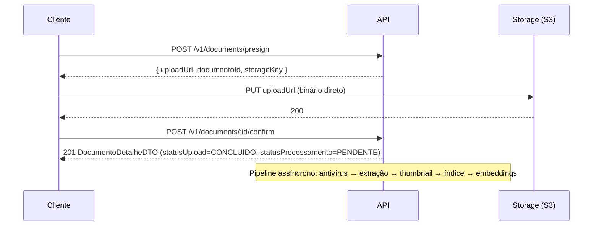

# 10 — Documents (Endpoints)

> Entidades `Documento`, `VersaoDocumento`, `Pasta` em
> [../database/05-entidades-documentos-colaboracao.md](../database/05-entidades-documentos-colaboracao.md).
> Tela em [../ux/07-documentos.md](../ux/07-documentos.md).

## 10.1 Fluxo de upload (visão geral)


O binário **nunca** trafega pela API — reafirma
[../database/05-entidades-documentos-colaboracao.md §5.3](../database/05-entidades-documentos-colaboracao.md)
e premissa 8/9 da modelagem de dados.

## 10.2 Endpoints

| Método | Rota | Objetivo | Permissão |
|---|---|---|---|
| `POST` | `/v1/documents/presign` | Obter URL assinada de upload | `document:create` |
| `POST` | `/v1/documents/:id/confirm` | Confirmar upload concluído | `document:create` |
| `GET` | `/v1/documents` | Listar/filtrar documentos | `document:read:{escopo}` |
| `GET` | `/v1/documents/:id` | Metadados + versão vigente | `document:read:{escopo}` |
| `PATCH` | `/v1/documents/:id` | Atualizar metadados | `document:update` |
| `DELETE` | `/v1/documents/:id` | Soft delete (lixeira) | `document:delete` |
| `POST` | `/v1/documents/:id/restore` | Restaurar da lixeira | `document:delete` |
| `GET` | `/v1/documents/:id/download` | URL assinada de download (5 min) | `document:download` |
| `GET` | `/v1/documents/:id/preview` | URL/stream de preview inline | `document:read:{escopo}` |
| `POST` | `/v1/documents/:id/versions` | Enviar nova versão (presign + confirm análogo) | `document:create` |
| `GET` | `/v1/documents/:id/versions` | Listar versões | `document:read:{escopo}` |
| `GET` | `/v1/documents/:id/versions/:versaoId/download` | Baixar versão específica | `document:download` |
| `PATCH` | `/v1/documents/:id/move` | Mover para outra pasta/processo | `document:folder:manage` |

## 10.3 `POST /v1/documents/presign`

**Body:** `{ "nomeArquivo": "contrato.pdf", "mimeType": "application/pdf",
"tamanhoBytes": 2400000, "processoId": "...", "pastaId": null }`.
**Resposta 201:**
```json
{ "documentoId": "...", "uploadUrl": "https://storage.../presigned",
  "expiraEm": "2026-08-12T15:05:00.000Z" }
```
**Erros:** `422` (`code: FILE_TOO_LARGE` >100MB, `code: MIME_NOT_ALLOWED`).
**Regra:** cria `Documento` com `statusUpload = PENDENTE`, sem
`versaoVigenteId` (reafirma
[../database/12-eventos-fluxos-regras.md §12.3.6](../database/12-eventos-fluxos-regras.md)).

## 10.4 `POST /v1/documents/:id/confirm`

**Body:** `{ "hashSha256": "..." }` (calculado no cliente, validado no
servidor). **Resposta 201:** `DocumentoDetalheDTO`. **Regras:** cria
`VersaoDocumento` v1, dispara pipeline assíncrono (antivírus → extração →
thumbnail → indexação → embeddings), dispara `DocumentoEnviado`. Se
`hashSha256` já existe no escritório, resposta inclui aviso não bloqueante
`{ "codigo": "DUPLICATE_FILE", "documentoExistenteId": "..." }` (reafirma
[../database/05-entidades-documentos-colaboracao.md §5.3](../database/05-entidades-documentos-colaboracao.md)).

## 10.5 `GET /v1/documents/:id/download`

**Resposta 200:** `{ "url": "https://storage.../signed", "expiraEm": "..." }`.
**Erros:** `423 Locked` (`code: FILE_INFECTED`) se `statusAntivirus =
INFECTADO` — bloqueio incondicional, reafirma regra 27 de
[../database/12-eventos-fluxos-regras.md §12.4](../database/12-eventos-fluxos-regras.md).
**Auditoria:** toda chamada bem-sucedida gera `LogAuditoria` (`document.download`)
— reafirma [../database/06-entidades-ia-notificacoes-auditoria.md §6.6.1](../database/06-entidades-ia-notificacoes-auditoria.md).
`GET /v1/documents/:id/preview` segue a mesma regra de auditoria
(`document.view`).

## 10.6 Pastas (`Pasta`)

> Endpoints identificados como pendência em
> [../ux/20-contexto-proxima-etapa.md](../ux/20-contexto-proxima-etapa.md).

| Método | Rota | Objetivo | Permissão |
|---|---|---|---|
| `GET` | `/v1/folders` | Árvore de pastas (por processo ou biblioteca geral) | `document:read:{escopo}` |
| `POST` | `/v1/folders` | Criar pasta | `document:folder:manage` |
| `PATCH` | `/v1/folders/:id` | Renomear/mover (novo `pastaPaiId`) | `document:folder:manage` |
| `PATCH` | `/v1/folders/:id/reorder` | Reordenar entre irmãs (`ordem`) | `document:folder:manage` |
| `DELETE` | `/v1/folders/:id` | Excluir (bloqueada se houver conteúdo, salvo `cascata=true`) | `document:folder:manage` |

**`DELETE /v1/folders/:id`:** **Erros:** `409` (`code:
FOLDER_NOT_EMPTY`) a menos que `?cascata=true` seja explicitamente passado —
reafirma confirmação explícita de
[../database/05-entidades-documentos-colaboracao.md §5.2](../database/05-entidades-documentos-colaboracao.md)
e [../ux/07-documentos.md §7.5](../ux/07-documentos.md). **`PATCH
/v1/folders/:id` (mover):** **Erros:** `422` (`code: CIRCULAR_REFERENCE`) se
o novo pai é a própria pasta ou um descendente; `422` (`code:
MAX_DEPTH_EXCEEDED`) acima de 6 níveis.

## 10.7 `PATCH /v1/documents/:id/move`

**Body:** `{ "pastaId": "...", "processoId": "..." }` (ambos opcionais,
`null` explícito move para "sem pasta"/biblioteca geral). Reafirma
[../ux/07-documentos.md §7.5](../ux/07-documentos.md), drag-and-drop de
documento para pasta.

---

**Anterior:** [09-legal-cases.md](09-legal-cases.md) · **Próximo:** [11-timeline.md](11-timeline.md)
