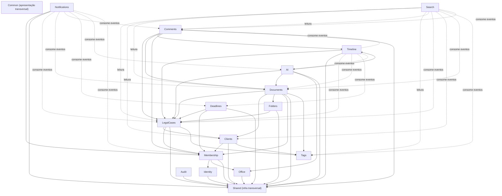

# 04 — Dependências e Acoplamento entre Módulos

## 4.1 Grafo de dependência



**Legenda:** seta sólida = dependência de import direto (interface/porta);
seta pontilhada = leitura de projeção ou consumo de evento assíncrono (baixo
acoplamento, sem import direto de código de domínio do módulo de origem).

## 4.2 Regras de acoplamento

1. **A seta nunca aponta para o núcleo a partir da borda.** `Identity` e
   `Office` não conhecem nenhum módulo de conteúdo — são a base.
   `Timeline`, `Notifications`, `Audit`, `Search` são as bordas de saída —
   nada depende deles.
2. **Referência entre agregados de módulos diferentes é sempre por ID**,
   nunca por objeto de domínio importado de outro módulo — reafirma
   [../database/06-modelo-dominio.md §6.1](../database/06-modelo-dominio.md)
   (mesmo princípio de bounded context, aplicado agora ao código).
3. **Comunicação preferencial entre módulos de conteúdo é por evento de
   domínio**, não por chamada direta de use case de outro módulo — `Timeline`
   e `Notifications` **nunca** são chamados diretamente por `LegalCases`;
   `LegalCases` publica `ProcessoCriado` e não sabe (nem precisa saber) quem
   consome. Isso é o que permite adicionar um novo consumidor (ex.: um futuro
   módulo de BI) sem tocar em `LegalCases`.
4. **Exceção deliberada — chamada direta permitida:** quando o módulo
   chamador precisa do **resultado síncrono** da operação para decidir seu
   próprio fluxo (ex.: `LegalCases.criarProcesso` precisa validar que
   `clienteId` existe em `Clients` antes de prosseguir) — nesse caso, o
   acoplamento é através da **interface de repositório** do módulo
   dependido (`ClienteRepository.existePorId`), injetada, nunca através do
   use case do outro módulo.
5. **`Search` nunca é fonte de verdade** — é projeção de leitura; se o
   índice de busca e o banco divergirem, o banco vence sempre (reindexação
   corrige o índice, nunca o contrário).

## 4.3 Teste de arquitetura (enforcement automatizado)

`dependency-cruiser` com regras explícitas por módulo, executado no CI:

```
modules/identity     NÃO pode importar modules/(office|membership|clients|legal-cases|...)
modules/office        NÃO pode importar modules/(membership|clients|legal-cases|...)
modules/timeline      NÃO pode ser importado por nenhum outro modules/*
modules/notifications NÃO pode ser importado por nenhum outro modules/*
modules/audit         NÃO pode ser importado por nenhum outro modules/*
modules/*/domain      NÃO pode importar @nestjs/*, @prisma/client
```

Violação de qualquer regra falha o build — a documentação desta pasta é
normativa e verificada por máquina, não apenas por revisão de código.

## 4.4 Por que isso importa para extração futura

A mesma propriedade já registrada em
[../05-arquitetura-backend.md §5.1](../05-arquitetura-backend.md) — "o
monólito modular já está desenhado para permitir extração futura" — depende
inteiramente desta disciplina de acoplamento. Os três candidatos a extração
já identificados (Documentos, IA, Busca) são exatamente os módulos que hoje
só se comunicam por evento/leitura de projeção com o resto do sistema —
extraí-los como serviço separado no futuro significa trocar "publicar evento
in-process" por "publicar evento na fila/broker", sem reescrever a lógica de
domínio de `LegalCases`.

---

**Anterior:** [03-camadas.md](03-camadas.md) · **Próximo:** [05-autenticacao.md](05-autenticacao.md)
