# 07 — Relacionamentos e Diagrama Entidade-Relacionamento

---

## 7.1 Diagrama ER — Fase 1

```mermaid
erDiagram
    USUARIO ||--o{ USER_IDENTITY : possui
    USUARIO ||--o{ SESSAO : mantem
    USUARIO ||--o{ MEMBRO : "atua via"

    ESCRITORIO ||--o{ MEMBRO : contem
    ESCRITORIO ||--o{ CONVITE : emite
    ESCRITORIO ||--o{ PAPEL : "define (custom)"
    ESCRITORIO ||--o{ EQUIPE : organiza

    MEMBRO }o--|| PAPEL : possui
    PAPEL ||--o{ PAPEL_PERMISSAO : agrupa
    PERMISSAO ||--o{ PAPEL_PERMISSAO : compoe
    MEMBRO ||--o{ PERMISSAO_USUARIO : sobrescreve
    PERMISSAO ||--o{ PERMISSAO_USUARIO : referencia
    MEMBRO }o--o| EQUIPE : integra

    ESCRITORIO ||--o{ CLIENTE : atende
    ESCRITORIO ||--o{ PROCESSO : gerencia
    CLIENTE ||--o{ PROCESSO : "e cliente principal em"
    MEMBRO ||--o{ PROCESSO : "e responsavel por"
    PROCESSO ||--o{ PROCESSO_MEMBRO : "tem equipe"
    MEMBRO ||--o{ PROCESSO_MEMBRO : integra
    PROCESSO ||--o{ PARTE_PROCESSO : envolve
    CLIENTE ||--o{ PARTE_PROCESSO : "pode ser parte"
    PROCESSO ||--o{ PROCESSO_RELACIONADO : "relaciona-se com"
    PROCESSO ||--o{ PRAZO : possui
    MEMBRO ||--o{ PRAZO : "e responsavel por"

    PROCESSO ||--o{ EVENTO_TIMELINE : registra
    MEMBRO ||--o{ EVENTO_TIMELINE : autora

    ESCRITORIO ||--o{ PASTA : organiza
    PROCESSO ||--o{ PASTA : contem
    PASTA ||--o{ PASTA : "e pai de"
    PASTA ||--o{ DOCUMENTO : armazena
    PROCESSO ||--o{ DOCUMENTO : anexa
    CLIENTE ||--o{ DOCUMENTO : relaciona
    DOCUMENTO ||--o{ VERSAO_DOCUMENTO : versiona
    MEMBRO ||--o{ DOCUMENTO : "fez upload de"

    PROCESSO ||--o{ COMENTARIO : recebe
    DOCUMENTO ||--o{ COMENTARIO : recebe
    EVENTO_TIMELINE ||--o{ COMENTARIO : recebe
    MEMBRO ||--o{ COMENTARIO : escreve
    COMENTARIO ||--o{ COMENTARIO : responde

    ESCRITORIO ||--o{ TAG : define
    TAG ||--o{ PROCESSO_TAG : marca
    PROCESSO ||--o{ PROCESSO_TAG : recebe
    TAG ||--o{ DOCUMENTO_TAG : marca
    DOCUMENTO ||--o{ DOCUMENTO_TAG : recebe
    TAG ||--o{ CLIENTE_TAG : marca
    CLIENTE ||--o{ CLIENTE_TAG : recebe

    PROCESSO ||--o{ RESUMO_IA : resume
    MEMBRO ||--o{ RESUMO_IA : solicita
    RESUMO_IA ||--o{ FONTE_IA : cita
    DOCUMENTO ||--o{ FONTE_IA : "e citado em"
    EVENTO_TIMELINE ||--o{ FONTE_IA : "e citado em"

    MEMBRO ||--o{ NOTIFICACAO : recebe
    MEMBRO ||--o{ PREFERENCIA_NOTIFICACAO : configura

    MEMBRO ||--o{ LOG_AUDITORIA : gera
    SESSAO ||--o{ LOG_AUDITORIA : contextualiza
    ESCRITORIO ||--o{ LOG_AUDITORIA : escopa
```

---

## 7.2 Explicação dos relacionamentos mais importantes

| Relação | Cardinalidade | Por quê importa |
|---|---|---|
| `Usuario` 1:N `Membro` | Um usuário, N vínculos | Base de todo o multi-tenant — a mesma pessoa atua em vários escritórios com papéis independentes (§1.8 em [01](01-estrategia-multitenancy.md)) |
| `Escritorio` 1:N `Membro`/`Cliente`/`Processo`/... | Um escritório, N registros de cada domínio | Todo registro de domínio "pendura" no escritório — é a coluna que a extensão Prisma e a RLS filtram em toda consulta |
| `Membro` N:1 `Papel` | N membros compartilham um papel | Papel é reutilizável; alterar o papel de sistema afeta todos os membros que o usam, por design |
| `Processo` N:1 `Cliente` | N processos, um cliente principal cada | `Processo.clienteId` é o atalho de exibição; litisconsórcio usa `ParteProcesso` (ver [04](04-entidades-clientes-processos.md) §4.2.4) |
| `Processo` 1:N `ProcessoMembro` N:1 `Membro` | N:N entre Processo e Membro | Equipe do processo é independente do responsável principal — permite "advogado de apoio" sem torná-lo responsável |
| `Processo` 1:N `EventoTimeline` | Um processo, N eventos | Consulta cronológica é o acesso dominante do produto — índice único mais crítico do sistema |
| `Pasta` 1:N `Pasta` (auto-relacionamento) | Hierarquia | Organização opcional de documentos, com prevenção de ciclo aplicada no código, não no schema |
| `Documento` 1:N `VersaoDocumento` | Um documento, N versões, uma vigente | Nunca sobrescreve — "v3_final_agora_vai" deixa de existir como problema |
| `ResumoIA` 1:N `FonteIA` | Um resumo, N fontes citadas | Requisito inegociável de rastreabilidade — resumo sem fonte não é `PRONTO` |
| `Comentario` 1:N `Comentario` (pai/filho) | Thread de 1 nível | Discussão simples, sem profundidade que a UI não precisa suportar |
| `Tag` N:N `Processo`/`Documento`/`Cliente` | Via tabelas associativas | Uma etiqueta reutilizada em qualquer entidade, sem duplicar cor/descrição |

---

## 7.3 Matriz de comportamento de exclusão (`ON DELETE`)

| Tabela filha | FK | Comportamento | Justificativa |
|---|---|---|---|
| `user_identity` | → `usuarios` | `CASCADE` | Identidade não existe sem usuário |
| `sessoes` | → `usuarios` | `CASCADE` | Idem |
| `sessoes` | → `escritorios` (ativo) | `RESTRICT` | Encerrar escritório revoga sessões antes, explicitamente |
| `membros` | → `usuarios` | `RESTRICT` | Usuário nunca é excluído fisicamente (anonimização) — `RESTRICT` é defesa adicional |
| `membros` | → `escritorios` | `RESTRICT` | Escritório com membros não é excluído fisicamente |
| `membros` | → `papeis` | `RESTRICT` | Papel em uso não pode ser excluído |
| `convites` | → `escritorios` | `CASCADE` | Convite não tem valor fora do escritório que o emitiu |
| `clientes` | → `escritorios` | `RESTRICT` | — |
| `processos` | → `clientes` | `RESTRICT` | Cliente com processo não é excluído fisicamente |
| `processos` | → `membros` (responsável) | `RESTRICT` | Reatribuição é obrigatória antes de qualquer remoção |
| `partes_processo` | → `processos` | `CASCADE` | Parte não sobrevive à exclusão física do processo (que na prática nunca ocorre — soft delete) |
| `processo_membro` | → `processos`, `membros` | `CASCADE` | Tabela associativa pura |
| `processo_relacionado` | → `processos` (ambos os lados) | `CASCADE` | Idem |
| `prazos` | → `processos` | `CASCADE` | Prazo não existe fora do processo |
| `eventos_timeline` | → `processos` | `CASCADE` | Idem |
| `eventos_timeline` | → `membros` (autor) | `SET NULL` | Autoria anonimizada preserva o evento |
| `pastas` | → `processos` | `CASCADE` | |
| `pastas` | → `pastas` (pai) | `RESTRICT` | Exclusão de pasta com subpastas é bloqueada até confirmação explícita em cascata lógica (soft delete), nunca cascade físico silencioso |
| `documentos` | → `processos` | `SET NULL` | Documento pode ficar órfão de processo, nunca de escritório |
| `documentos` | → `clientes` | `SET NULL` | |
| `documentos` | → `pastas` | `SET NULL` | Mover para "sem pasta" em vez de apagar |
| `versoes_documento` | → `documentos` | `CASCADE` | Versão não existe fora do documento |
| `comentarios` | → `processos`/`documentos`/`eventos_timeline` | `CASCADE` | |
| `comentarios` | → `comentarios` (pai) | `CASCADE` | |
| `processo_tag`/`documento_tag`/`cliente_tag` | → ambos os lados | `CASCADE` | Tabelas associativas puras |
| `resumos_ia` | → `processos` | `RESTRICT` | Preserva rastreabilidade — processo com resumo não é excluído fisicamente (na prática nunca ocorre) |
| `fontes_ia` | → `resumos_ia` | `CASCADE` | Fonte não existe fora do resumo |
| `notificacoes` | → `membros` | `CASCADE` | Sem valor de retenção além do destinatário |
| `preferencias_notificacao` | → `membros` | `CASCADE` | |
| `log_auditoria` | → `membros`, `escritorios`, `sessoes` | `RESTRICT` / `RESTRICT` / `SET NULL` | Auditoria nunca perde o registro por exclusão de referência — sessão pode ser limpa, ator e escritório não |

**Princípio geral:** `CASCADE` só é usado quando a tabela filha **não tem
sentido de existir** sem a pai (versão sem documento, parte sem processo).
`RESTRICT` é usado sempre que a exclusão física da pai é, de toda forma, um
evento que não deveria acontecer silenciosamente (a estratégia de soft delete
já torna isso raro na prática — `RESTRICT` é a rede de segurança para o caso de
expurgo administrativo malconduzido). `SET NULL` é usado apenas onde "ficar
órfão" é um estado de negócio válido e esperado.

---

## 7.4 Referências polimórficas (sem FK física) — inventário

Postgres não modela FK para "uma de várias tabelas possíveis" nativamente.
Três pontos do modelo usam esse padrão deliberadamente, sempre com a mesma
mitigação (escrita atômica em transação única + validação na aplicação):

| Campo | Tabela | Aponta para |
|---|---|---|
| `entidadeRelacionadaTipo/Id` | `eventos_timeline` | `documentos`, `prazos`, `comentarios`, `resumos_ia` |
| `entidadeRelacionadaTipo/Id` | `notificacoes` | Qualquer entidade de domínio |
| `sourceType/sourceId` | `fontes_ia` | `documentos`, `eventos_timeline` |

Alternativa considerada e descartada: FK física por tabela-tipo (uma coluna de
FK nula por tipo possível). Rejeitada por inflar o schema a cada novo tipo de
origem e por não eliminar a necessidade de validação na aplicação de qualquer
forma (ainda seria preciso garantir que só uma das colunas está preenchida).

---

**Anterior:** [06-entidades-ia-notificacoes-auditoria.md](06-entidades-ia-notificacoes-auditoria.md) · **Próximo:** [08-permissoes-seguranca.md](08-permissoes-seguranca.md)
