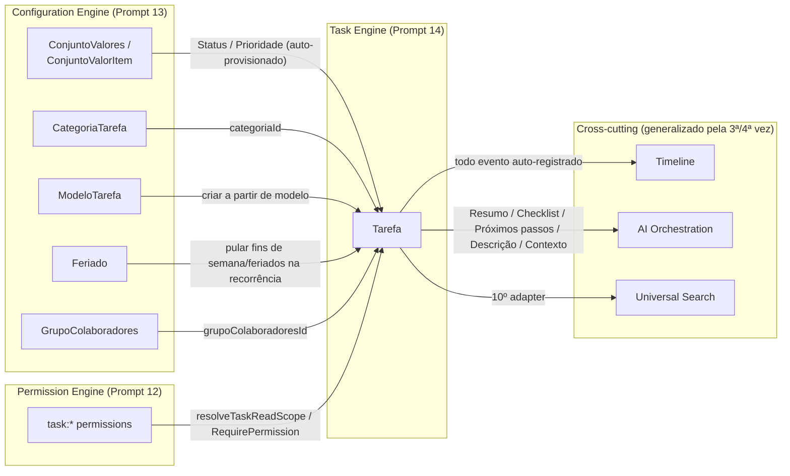
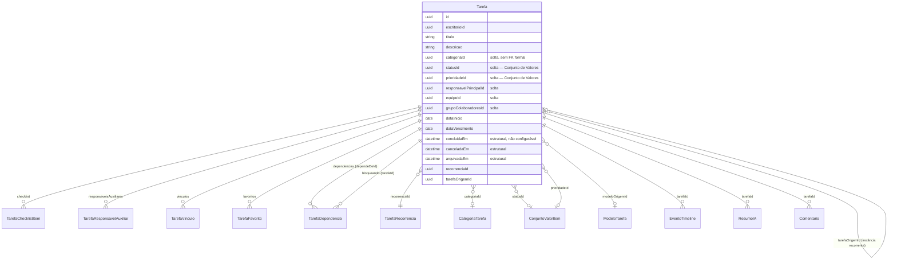
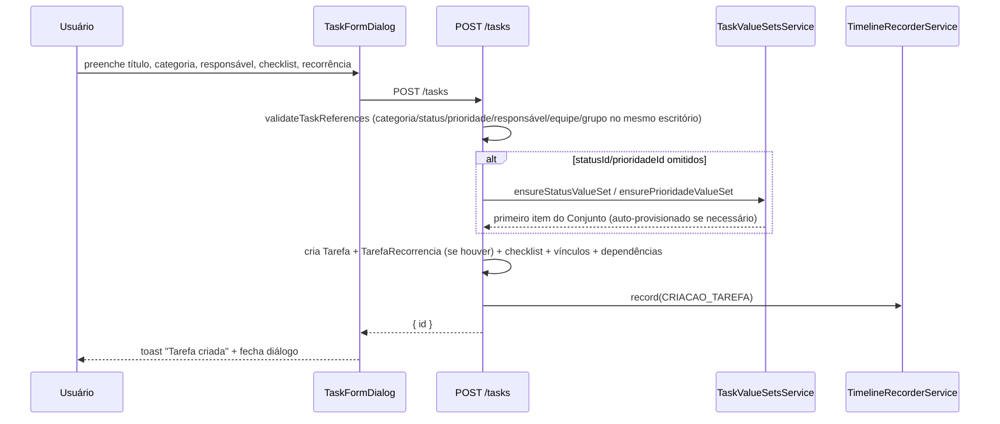
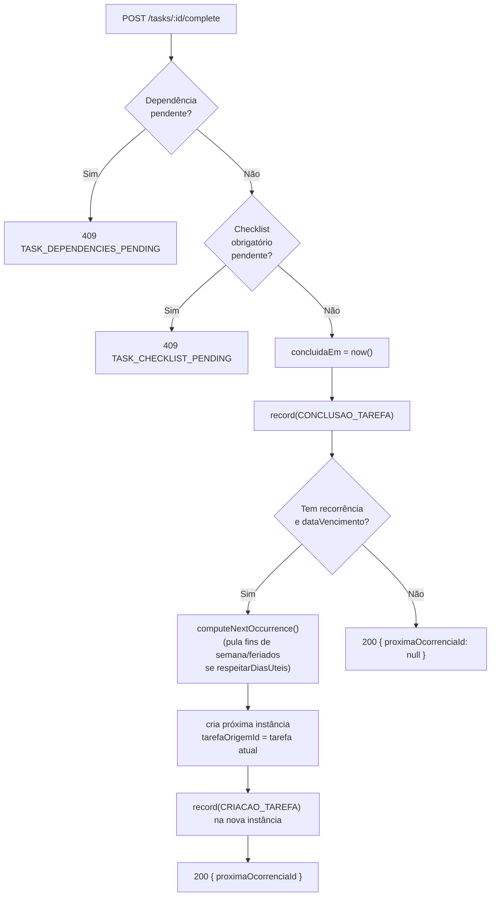
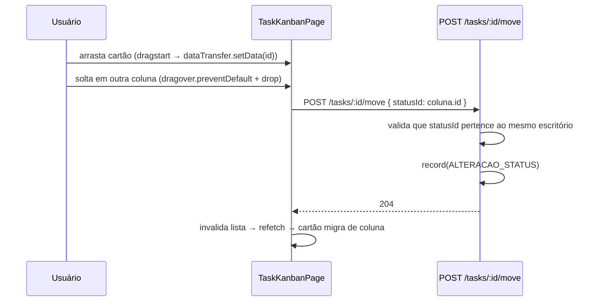

# Task Engine — Documentação Completa (Prompt 14)

> Motor de produtividade do Quilombo Dev — não uma lista de tarefas, um
> sistema completo de Kanban, Calendário, Templates, Checklist,
> Dependências, Recorrência, Vínculos multi-entidade, Timeline automática,
> IA e Busca. Este documento cobre backend (`apps/api/src/modules/tasks/`)
> e frontend (`apps/web/src/features/tasks/`) juntos. Para o changelog
> técnico detalhado de cada lado, ver
> [`docs/backend-implementation/23-task-engine.md`](backend-implementation/23-task-engine.md)
> e [`docs/frontend-implementation/00-status.md §0.5.12`](frontend-implementation/00-status.md).

## 1. Princípio norteador: reaproveitar, nunca duplicar

Antes de criar qualquer campo ou entidade, o Task Engine verifica se o
Configuration Engine (Prompt 13) já parametriza o conceito. Nenhum "Status"
ou "Prioridade" é um enum fixo: ambos são Conjuntos de Valores
auto-provisionados na primeira tarefa de cada escritório. Categorias e
Modelos de Tarefa, que existiam apenas como catálogo administrável desde o
Prompt 13, ganham aqui seu primeiro consumidor de negócio real.

## 2. Diagrama de entidades

**Por que colunas soltas (sem `@relation` Prisma) para
`responsavelPrincipalId`/`equipeId`/`grupoColaboradoresId`/`categoriaId`/
`statusId`/`prioridadeId`/`modeloOrigemId`?** Porque
`Processo.responsavelPrincipalId`/`ProcessoMembro.membroId` já
estabeleceram esse padrão desde o Prompt 7 — módulos desacoplados,
validação em `task-validation.ts` na escrita, resolução via
`PrismaService` puro na leitura. Nenhum import de módulo Nest entre Tasks
e Configuration/Membros/Equipes.

## 3. Fluxos principais

### 3.1 Criar tarefa (com checklist e recorrência opcionais)

### 3.2 Concluir tarefa — "teto de bloqueio"

Item de checklist **opcional** nunca bloqueia — só `obrigatorio: true` +
`concluidoEm: null` entra na verificação.

### 3.3 Kanban — arrastar entre colunas

Drag-and-drop usa a API nativa do navegador (`draggable`,
`dragstart`/`dragover`/`drop`) — zero biblioteca nova, mesma disciplina
anti-dependência de todas as rodadas anteriores.

## 4. Menu e rotas do frontend

| Item do menu | Rota | Componente |
|---|---|---|
| Minhas Tarefas | `/tarefas/minhas` | `TaskListPage scope="meus"` |
| Equipe | `/tarefas/equipe` | `TaskListPage scope="equipe"` |
| Kanban | `/tarefas/kanban` | `TaskKanbanPage` |
| Calendário | `/tarefas/calendario` | `TaskCalendarPage` (reaproveita `CalendarView` genérico) |
| Templates | `/configuracoes/modelos-tarefa` | `TaskTemplatesPage` (Configuration Engine, reaproveitado) |
| Categorias | `/configuracoes/categorias-tarefas` | `TaskCategoriesPage` (idem) |
| Relatórios | `/tarefas/relatorios` | `ModulePlaceholderPage` (honesto, sem dado simulado) |
| *(detalhe)* | `/tarefas/[id]` | `TaskDetailPage` — 7 abas |

`/tarefas` (bare) faz `redirect('/tarefas/minhas')`. "Templates" e
"Categorias" apontam para as rotas do Configuration Engine que já existiam
— nenhuma tela nova duplicada só para viver sob o grupo "TAREFAS" do menu.

### 4.1 Abas da página de detalhe

| Aba | Conteúdo |
|---|---|
| Detalhes | Descrição, categoria, responsável, datas, recorrência, origem (se instância recorrente), responsáveis auxiliares |
| Checklist | Itens com toggle de conclusão, badge "Obrigatório", adicionar/remover |
| Dependências | "Esta tarefa depende de" (com badge Pendente/Concluída) + "Bloqueando" (somente leitura) |
| Vínculos | Cliente/Processo/Documento (link real) + 6 tipos catálogo-apenas (chip com ID) |
| Timeline | Somente leitura — todo evento automático da tarefa |
| Comentários | Criar/listar (sem edição/exclusão/menções) |
| IA | `AiSummaryPanel` com as 5 ações: Resumo, Gerar checklist, Próximos passos, Gerar descrição, Explicar contexto |

## 5. Matriz de permissões

| Permissão | Escopo | Onde é exigida |
|---|---|---|
| `task:create` | — | Criar tarefa, criar a partir de modelo, duplicar |
| `task:read:all` | ALL | Lê qualquer tarefa do escritório |
| `task:read:team` | TEAM | Lê tarefas da própria equipe |
| `task:read:assigned` | ASSIGNED | Permissão mínima — toda rota de leitura a exige |
| `task:update` | — | Editar, mover, checklist, dependências, vínculos, ciclo de vida |
| `task:delete` | — | Excluir, restaurar |
| `task:team:manage` | — | Adicionar/remover responsável auxiliar |
| `comment:create` | — | Comentar (permissão pré-existente, reaproveitada, não duplicada) |

O gate de rota sempre usa a permissão de escopo mais fraca
(`task:read:assigned`); o filtro de fato (qual conjunto de tarefas volta)
é resolvido por `resolveTaskReadScope`/`buildTaskScopeWhere`
(`task-scope.ts`, mirror exato de `case-scope.ts`).

## 6. Boas práticas seguidas nesta rodada

1. **Nunca um enum fixo onde o Configuration Engine já resolve** —
   Status/Prioridade são sempre `{id, valor}`, nunca uma string literal.
2. **Colunas soltas para referências cross-módulo**, validadas na escrita
   (`task-validation.ts`), nunca uma FK Prisma formal — mesmo padrão de
   `Processo` desde o Prompt 7.
3. **Generalizar em vez de duplicar**: Timeline, IA, Busca e (no
   frontend) `CalendarView`/`FavoriteButton` foram estendidos, nunca
   reimplementados.
4. **Timestamps estruturais ≠ status configurável**: `concluidaEm`/
   `canceladaEm`/`arquivadaEm` nunca dependem do texto de um Conjunto de
   Valores que o tenant pode renomear ou excluir a qualquer momento.
5. **Recorrência sem inventar infraestrutura**: função pura e síncrona,
   porque este projeto não tem fila (BullMQ) — nenhuma fila fake criada só
   para parecer "completo".
6. **Escopo pragmático, documentado, nunca escondido**: ciclo transitivo
   de dependências, busca real de vínculo, Comments completo e
   Relatórios ficaram fora desta rodada — cada um com uma linha própria em
   "Pendências", nunca simulado como pronto.
7. **Zero dependência nova**: drag-and-drop nativo, nenhum date-picker/
   command-menu de terceiros.

## 7. Casos de uso

- **Advogado cria uma tarefa vinculada a um processo** a partir do botão
  "Nova tarefa" nas Ações Rápidas de `LegalCaseDetailPage` — a tarefa já
  nasce com `vinculos: [{tipoRecurso: 'PROCESSO', recursoId}]`.
- **Gestor cria uma tarefa recorrente semanal** ("Enviar relatório"),
  marcando "Repetir esta tarefa" → Semanalmente → "Pular fins de semana e
  feriados". Toda vez que a instância atual é concluída, a próxima nasce
  automaticamente com a mesma configuração.
- **Assistente usa um Modelo** ("Contestação Padrão") para criar uma
  tarefa já com categoria, prioridade e checklist padrão preenchidos,
  ajustando só o responsável e a data de vencimento.
- **Equipe organiza o dia a dia no Kanban**, arrastando cartões entre
  colunas que refletem exatamente os Conjuntos de Valores configurados
  para o escritório (nunca "A Fazer/Em Andamento/Concluído" fixos no
  código).
- **Uma tarefa não pode ser fechada** porque depende de outra ainda
  pendente ou tem um item de checklist obrigatório sem marcar — o usuário
  vê o motivo exato via toast, nunca um erro genérico.
- **Solicitar à IA** um resumo, um checklist sugerido, os próximos passos,
  uma descrição ou o contexto da tarefa — respeitando o mesmo escopo de
  leitura (`task-scope.ts`) de quem está pedindo.

## 8. Pendências conhecidas (ver documentos de changelog para o detalhe completo)

1. Detecção de ciclo transitivo em dependências (só o ciclo direto de 2
   nós é bloqueado).
2. Busca/autocomplete real na aba Vínculos (hoje aceita colar o ID).
3. Comments completo (edição/exclusão/menções).
4. Relatórios de produtividade/SLA.
5. Entidade `Equipe` (departamento) sem CRUD próprio — `equipeId`
   continua uma coluna solta sem seletor no formulário.

---

**Ver também:** [backend-implementation/23-task-engine.md](backend-implementation/23-task-engine.md) ·
[frontend-implementation/00-status.md §0.5.12](frontend-implementation/00-status.md) ·
[backend-implementation/22-configuration-engine.md](backend-implementation/22-configuration-engine.md)
