# 03 — Jornadas do Usuário

> Complementa [../03-fluxos-e-telas.md](../03-fluxos-e-telas.md) com a ótica de
> experiência (o que o usuário vê, sente e decide em cada passo), não apenas a
> lógica de sistema.

---

## 3.1 Cadastro

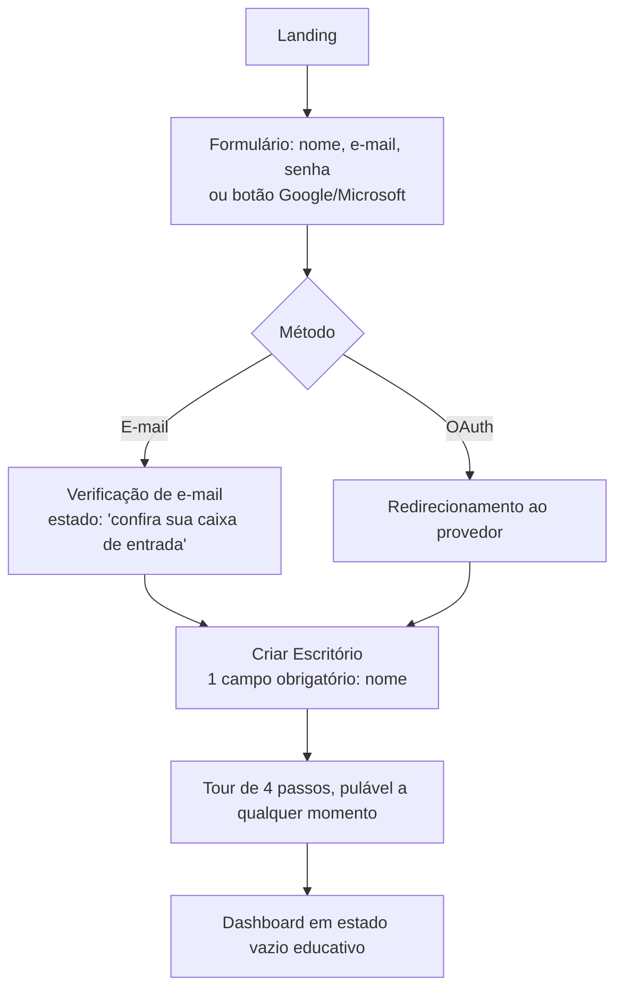
**Sensação-alvo:** "isso foi rápido" — nenhuma tela pede mais de 3 campos.
**Ponto de atenção de UX:** o botão "Pular" do tour tem o mesmo peso visual do
"Próximo" — pular não pode parecer punição.

## 3.2 Login

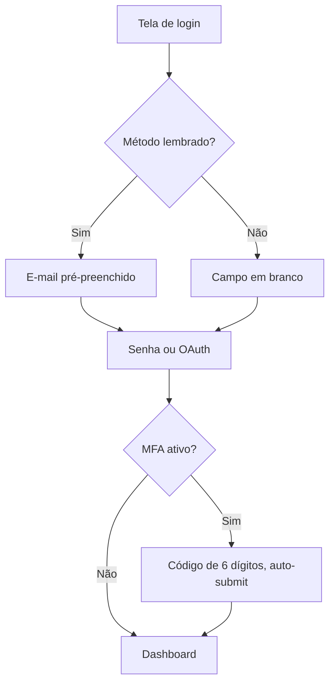
**Sensação-alvo:** familiaridade — layout idêntico a cada visita, campo de
e-mail já focado ao carregar a tela.

## 3.3 Escolha do escritório

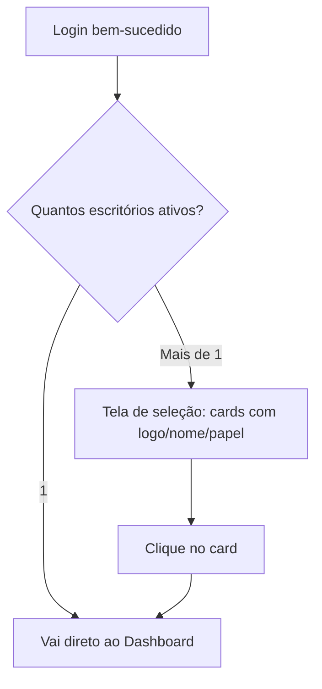
**Sensação-alvo:** nunca ambíguo sobre qual escritório está ativo — o nome do
escritório aparece no topo da Sidebar em todas as telas seguintes, sempre
clicável para trocar.

## 3.4 Primeiro acesso (pós-onboarding)

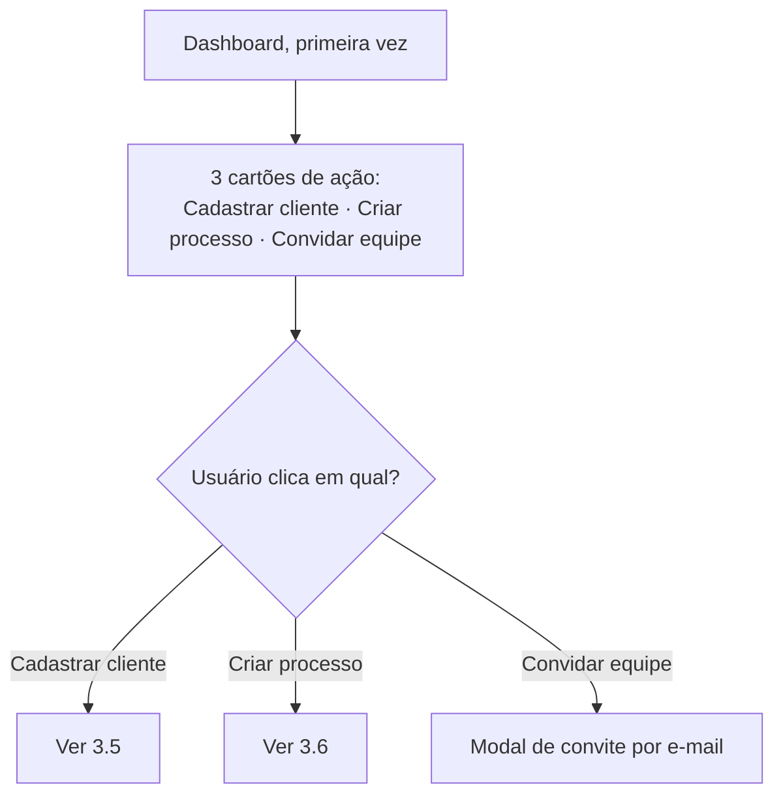
**Sensação-alvo:** o Dashboard vazio não parece "quebrado" — parece um convite
claro a agir, nunca uma tela sem conteúdo sem explicação.

## 3.5 Primeiro cliente

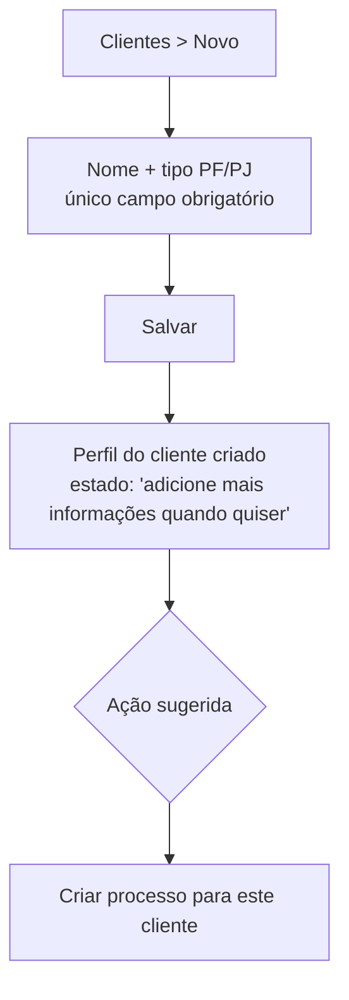
**Sensação-alvo:** nenhuma fricção — de "Novo" a "salvo" em menos de 20 segundos.

## 3.6 Primeiro processo

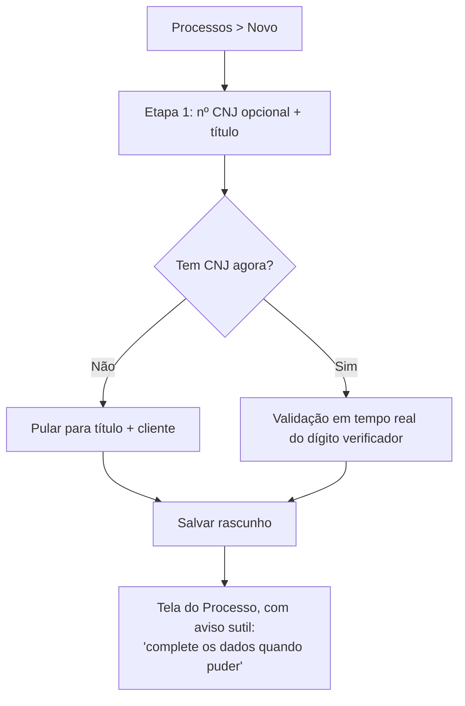
**Sensação-alvo:** o usuário nunca é bloqueado por um campo que não tem à mão
naquele momento.

## 3.7 Primeiro documento

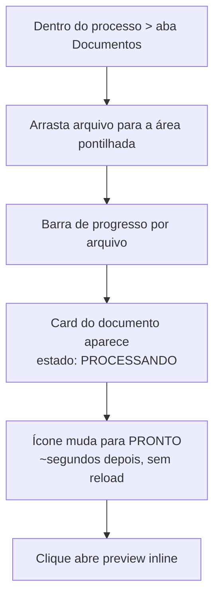
**Sensação-alvo:** "já posso ver o documento antes mesmo do processamento
terminar" — nunca uma tela de espera bloqueante.

## 3.8 Primeiro resumo por IA

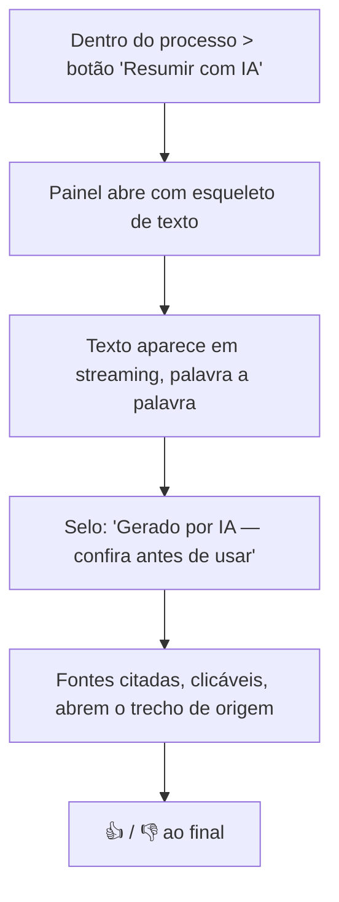
**Sensação-alvo:** confiança calibrada — o usuário sente que pode verificar
cada afirmação, nunca que precisa "confiar cegamente".

## 3.9 Primeira busca

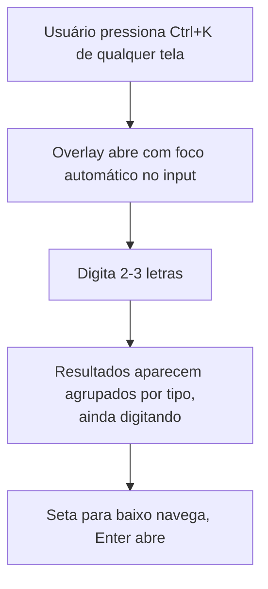
**Sensação-alvo:** "achei antes de terminar de digitar" — ver
[09-busca-global.md](09-busca-global.md) para a engenharia de percepção de
velocidade.

## 3.10 Primeira notificação

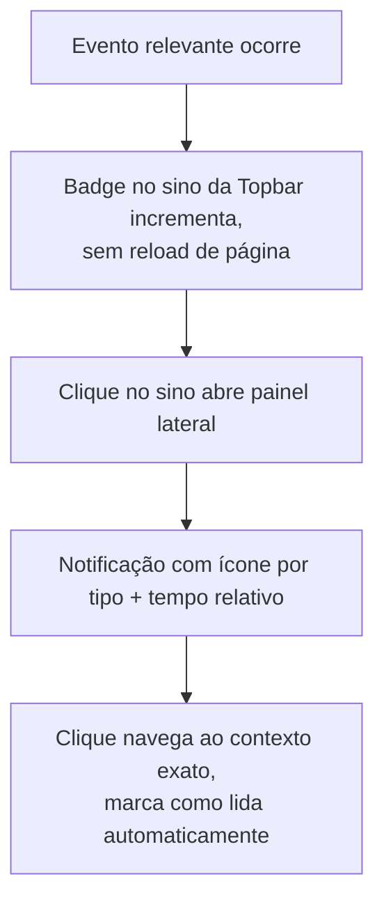
**Sensação-alvo:** o clique na notificação sempre leva ao lugar certo — nunca
a uma tela genérica onde o usuário precisa procurar de novo.

## 3.11 Primeiro comentário

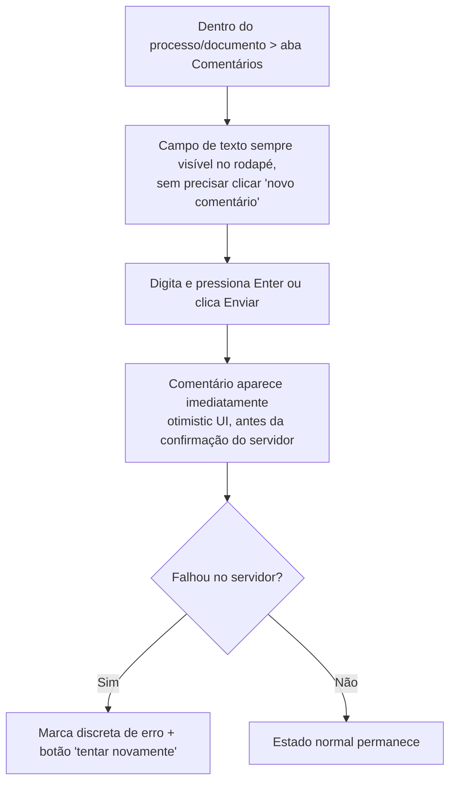
**Sensação-alvo:** comentar parece tão rápido quanto mandar mensagem de
WhatsApp — nunca há espera perceptível.

## 3.12 Encerramento da sessão

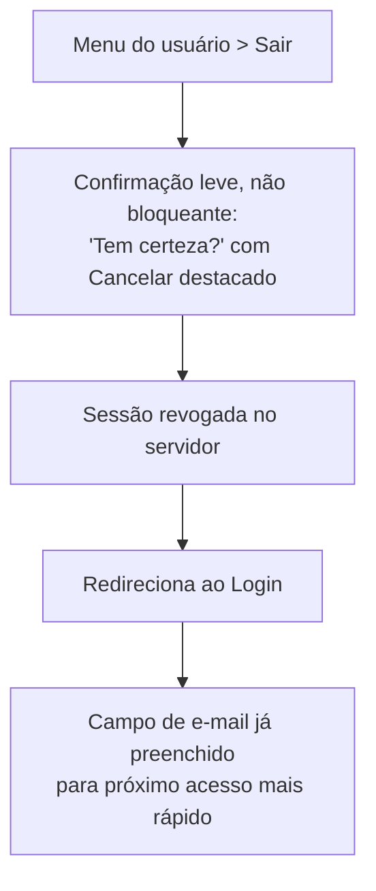
**Sensação-alvo:** sair é tão simples quanto entrar — sem etapas extras, sem
perguntas desnecessárias ("por que está saindo?").

---

## 3.13 Princípio transversal de todas as jornadas

Nenhuma jornada acima tem mais de 6 passos entre a intenção e a conclusão.
Onde uma jornada real do produto (ex.: configurar SSO, Fase 2) exigir mais
passos, ela é quebrada em uma jornada guiada com indicador de progresso — nunca
apresentada como uma lista única de 10+ itens.

---

**Anterior:** [02-personas.md](02-personas.md) · **Próximo:** [04-navigation.md](04-navigation.md)
